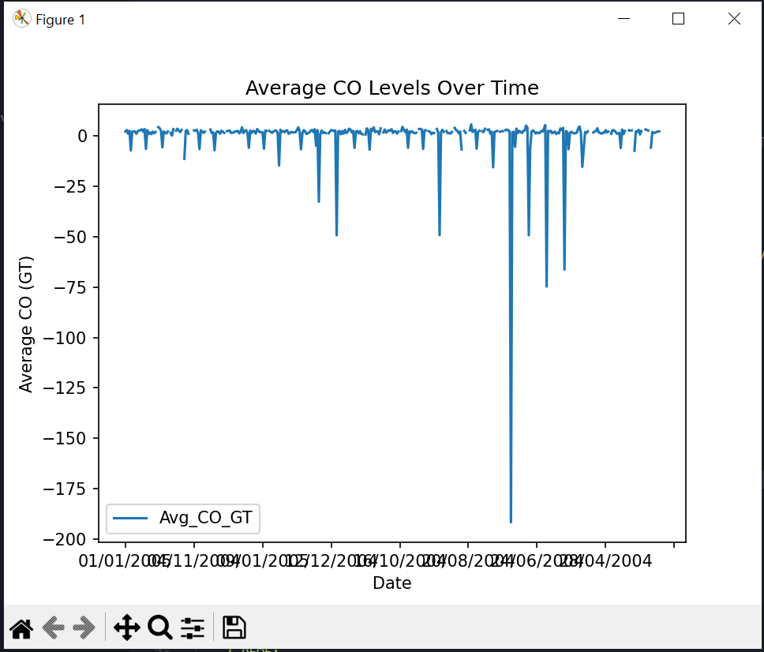
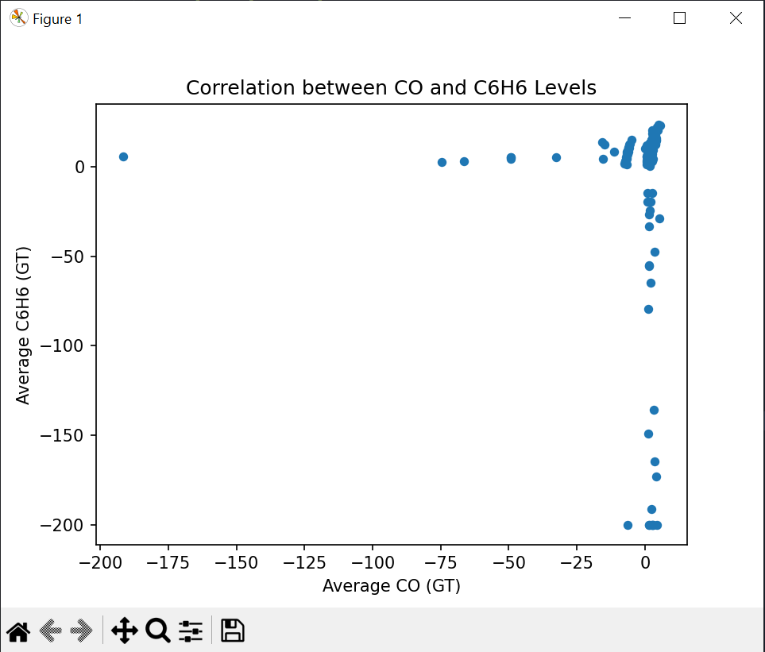
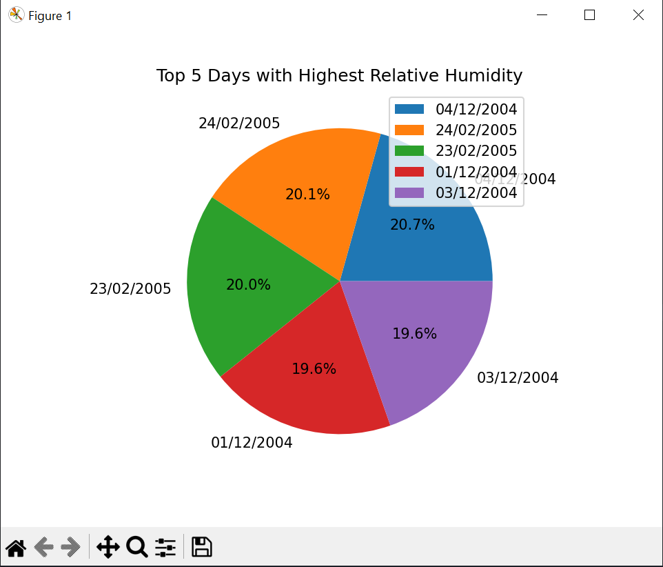

# Pandas Air Quality Dataset

This project demonstrates techniques for handling, processing, and visualizing large datasets in Python using the `pandas` library. The demo uses the [Air Quality Dataset](https://archive.ics.uci.edu/ml/datasets/air+quality) to showcase practical data handling methods, focusing on environmental data analysis.

## Project Overview

The main objectives of this project are to:
- Efficiently process large datasets using chunking.
- Perform data aggregation and summarization using `pandas`.
- Visualize trends and insights from the data.

## Features

- **Chunk Processing**: Handles large datasets by processing data in chunks, ensuring efficient memory usage.
- **Data Aggregation**: Groups data by date and calculates daily averages for:
  - Carbon Monoxide (CO)
  - Benzene (C6H6)
  - Temperature (T)
  - Relative Humidity (RH)
- **Visualizations**:
  - Line chart showing daily average CO levels over time.
  - Scatter plot illustrating the correlation between CO and Benzene levels.
  - Pie chart highlighting the top 5 days with the highest relative humidity.
- **Database Integration**: Saves processed and aggregated results to a SQLite database (`output_data.db`) for persistence and further analysis.

## Dataset

The dataset used for this project is the Air Quality Dataset, which includes hourly sensor readings for atmospheric variables. **Key columns used in this project**:
- `Date`
- `Time`
- `CO(GT)` (Carbon Monoxide concentration)
- `C6H6(GT)` (Benzene concentration)
- `T` (Temperature in Celsius)
- `RH` (Relative Humidity in %)

## Prerequisites

To run this project, ensure you have Python installed along with the required libraries. Install dependencies using:

```bash
pip install pandas sqlite3 matplotlib
```

## Usage

1. Clone this repository and navigate to the project directory.
2. Ensure the processed_air_quality.csv file is in the project folder.
3. Run the Python script:
```bash 
python main.py
 ```

 # Outputs

 ## Database Output

 Aggregated results are saved to the SQLite database `output_data.db`, under the table `air_quality_summary`. This table contains:

* `Date`: The date of measurement.
* `Avg_CO_GT`: Average Carbon Monoxide concentration.
* `Avg_C6H6_GT`: Average Benzene concentration.
* `Avg_Temperature`: Average temperature.
* `Avg_Relative_Humidity`: Average relative humidity.

## Visualizations

The following charts are generated to provide insights:

1. Average CO Levels Over Time
Line chart displaying daily average CO levels to show trends over time.





2. Correlation Between CO and Benzene Levels
Scatter plot highlighting the relationship between CO and Benzene concentrations.





3. Top 5 Days with Highest Relative Humidity
Pie chart showing the relative distribution of humidity levels for the top 5 days.




## Contact

For questions or feedback, please reach out at [kcparks1234@gmail.com].


